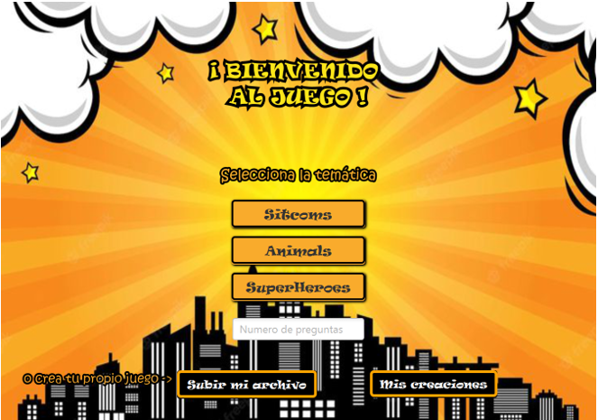

# 💻 Dhamar Quishpe

<h1>Hola, Soy Dhamar Quishpe 👩‍💻</h1>

<h2> Desarrolladora Web | Amante del Código | Solucionadora de Problemas </h2>
<h3>Una apasionada programadora y desarrolladora web apasionada por crear soluciones eficientes 🚀</h3>

    
    
    

--

## 🌟 **Contenido**
* [Sobre Mí](#-sobre-mí)
* [Intereses](#-intereses)
* [Proyectos](#-proyectos)
* [Tecnologías y herramientas](#-tecnologías-y-herramientas)
* [Estadísticas de GitHub](#-estadísticas-de-github)
* [Contáctame](#-contáctame)

---

## 🪪 **Sobre Mí**
Soy un estudiante dedicado con un gran interés en aprender y aplicar nuevas tecnologías. Me encanta resolver problemas y crear experiencias de usuario atractivas.  
Desde el primer código que escribí, me enamoré de la programación y sus posibilidades. Me interesa el área de la ciencia de datos, inteligencia artificial y desarrollo web, y profundicé en lenguajes como Python, JavaScript y Java, que utilizo para construir aplicaciones y soluciones orientadas a resolver problemas reales.

- **Mi Currículum:** [https://dquishpe.github.io/curriculum/](https://dquishpe.github.io/curriculum/)

---

## 🌟 **Intereses** 
- Inteligencia Artificial: Investigo y aplico técnicas de aprendizaje automático y procesamiento de lenguaje natural.  
- Ciencia de Datos: Analizo datos para obtener insights y desarrollar modelos predictivos.   
- Desarrollo Frontend y Backend: Me apasiona crear aplicaciones web completas, desde interfaces atractivas hasta funcionalidades robustas en el servidor.  
- Diseño de Interfaces Intuitivas: Me enfoco en garantizar una excelente experiencia de usuario mediante diseños limpios y funcionales.  

---

## 💼 **Proyectos**  
Aquí te presento algunos de los proyectos que he desarrollado:  

### 1. 💡 **Polinator**  
- **Descripción:** Polinator es una aplicación interactiva desarrollada para adivinar lo que estás pensando, ya sea un animal, superhéroe o personaje de una sitcom. La interfaz es moderna y amigable, diseñada para proporcionar una experiencia entretenida e intuitiva.
- **Tecnologías utilizadas:** Java, JavaFX, CSS.  
- [🔗 Repositorio](https://github.com/randyRivera0/Polinator.git)

    

### 2. 🌐 **Repositorio ESPOL**  
- **Descripción:** Repositorio ESPOL es una aplicación diseñada para gestionar y compartir recursos académicos de manera eficiente. Los administradores pueden subir y organizar lecciones, exámenes, apuntes y otros materiales de estudio, mientras que los estudiantes pueden acceder a estos recursos de forma sencilla.
- **Tecnologías utilizadas:** MySQL, Java, JavaFX, CSS.  
- [🔗 Repositorio](https://github.com/randyRivera0/EduRepoEspol.git)

    

### 3. 🪞 **Landing page: El Rincón de las Letras**  
- **Descripción:** Este proyecto consiste en crear una landing page interactiva para una tienda de libros, con secciones para nuevos lanzamientos y géneros destacados. Utiliza HTML, CSS y Bootstrap para un diseño responsivo, JavaScript para interactividad, y Firebase para gestionar datos en tiempo real, ofreciendo una experiencia moderna y atractiva para los amantes de la lectura.
- **Tecnologías utilizadas:** JavaScript, Bootstrap, Firebase, HTML, CSS.  
- [🔗 Repositorio](https://github.com/dquishpe/landing.git)

    

---

## 🚀 **Tecnologías y Herramientas**  
Estas son algunas de las herramientas y tecnologías con las que he trabajado:  

---

## 📊 **Estadísticas de GitHub**  

  

---

## 📞 **Contáctame**  
- 📧 **Correo:** [dquishpe@espol.edu.ec](mailto:dquishpe@espol.edu.ec)  
- 💼 **LinkedIn:** ["https://www.linkedin.com/in/dhamar-quishpe-280035229/"](https://www.linkedin.com/in/dhamar-quishpe-280035229/)  

---

<h2 style="color: #6f3974; font-size: 30px; ">  
✨ La tecnología es el lenguaje que uso para transformar ideas en realidades ✨  
</h2>

¡Gracias por visitar mi portafolio! 😊

